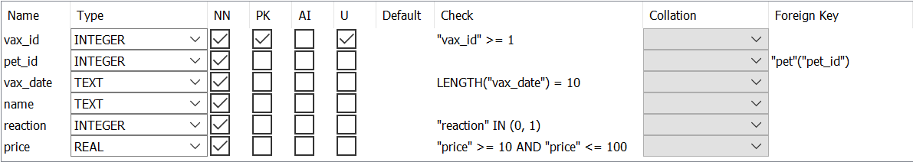

# N5 Computing Science
{:.no_toc}

[Home](index.md)

## Database Design and Development
{:.no_toc}

All the code examples use SQLite.  They will work with [Replit](https://replit.com/) and [DB Browser for SQLite](https://sqlitebrowser.org/).

**Note:** These notes are focused on N5 Computing Science so some terms are used differently.

SQLite, and SQL, keywords are not case sensitive.  The following are all equally valid:

``` sql
SELECT / SeLeCt / select
```

In the examples, the keywords will be in uppercase.

SQLite, and SQL, is not whitespace sensitive.  This means a statement can be all on a single line or split over multiple lines.  In general, the examples have one keyword per line.

The statements are terminated with a semicolon, __`;`__.  An individual statement will run without a semicolon but multiple statements will not.

## Table of Contents {#toc}
{:.no_toc}

* TOC will be displayed here
{:toc}

### Attribute types (Data types)

SQLite has fewer data types than SQL.  SQLite has:

* Text
* Integer
* Real

The `text` datatype can be used for:

* Date: "2022-08-15" (YYYY-MM-DD)
* Time: "15:40:00" (HH:MM:SS)

The `integer` datatype can be used for:

* Boolean: 0, 1 (`False`, `True`)

### Example Data

The example [database](https://stackedit.io/N5-CS-Database.db) contains the tables and records that the SQL examples will work with. The file can be opened with [DB Browser for SQLite](https://sqlitebrowser.org/).

The first 4 records of the data used in the examples are shown in the following tables:

#### Table: pet
{:.no_toc}

| pet_id | name | species | dob |
| :----: | ---- | ------- | --- |
| 1 | Hans | Cat | 2015-09-22 |
| 2 | Minnnie | Gerbil | 2021-05-24 |
| 3	| Bo | Rabbit | 2011-10-13 |
| 4 | Joscelin | Gerbil | 2022-02-19 |

#### Table: vaccination
{:.no_toc}

| vax_id | pet_id | vax_date | name | reaction | price |
| :----: | :----: | -------- | ---- | :------: | ----- |
| 1 | 13 | 2019-09-03 | Distemper | 1 | 45.00 |
| 2 | 5 | 2020-06-23 | Canine hepatitis | 0 | 35.50 |
| 3 | 1 | 2015-12-17 | Cat Flu | 0 | 12.99 |
| 4 | 17 | 2015-10-05 | Cat Flu | 0 | 12.99 |

#### ER Diagram
{:.no_toc}


[Back to Table of Contents](#toc)

### Keys and Validation

These examples use [DB Browser for SQLite](https://sqlitebrowser.org/).



#### Keys

| Key| Example | Comment |
| -- | ------- | ------- | 
| Primary | __PK__ column| PK = Primary Key |
| Foreign | "pet"("pet_id") | table(field)|

#### Validation

| Key | Example | Comment |
| --- | ------- | ------- |
| Presence check | __NN__ column | NN = Not Null |
| Restricted choice | Check: "reaction" __IN__ (0,1) | list of acceptable values |
| Field length | Check: __LENGTH__("vax_date") = 10 | ? |
| Range | Check: "price" __>= 10 AND__ "price" __<= 100__ | ? |

[Back to Table of Contents](#toc)

## Information

### Comments

``` sql
-- This comment is not displayed
```

### Display information
It is possible to display simple messages using the `.print` command.

``` sql
.print Hello World!
```

## Search

To search a database, a basic statement with two keywords `SELECT` and `FROM` is used.

The `SELECT` keyword lists the required field(s).  The `FROM` keyword states the table(s) that the fields are in.

To display all the fields the __`*`__ symbol is used.

``` sql
SELECT *
    FROM pet;
```

To select one, or more fields, their names are used.

``` sql
SELECT name, species
    FROM pet;
```

[Back to Table of Contents](#toc)

## Refine search

To limit the number of records returned, the `WHERE` keyword is used with a comparison operator.

### Comparison operators

Comparison operators are used to compare one value with another.

| Symbol | Meaning |
| :--: | :-- |
| = | Equality (the same as) |
| <> | Inequality (not the same as) |
| > | Greater than |
| >= | Greater than or equal to |
| < | Less than |
| <= | Less than or equal to |

### Simple search

A simple search compares a field in a record with a value.  If the comparison is `True` then the required fields of that record are displayed.

``` sql
SELECT *
    FROM vaccination
    WHERE species = "Cat";
```

[Back to Table of Contents](#toc)

### Complex search

A complex search compares two fields.

#### AND

If both comparisons are `True` then the required fields of that record are displayed.

``` sql
SELECT *
    FROM vaccination
    WHERE name = "Distemper"
        AND reaction = True;
```

#### OR

If either comparison is `True` then the required fields of that record are displayed.

``` sql
SELECT *
    FROM vaccination
    WHERE name = "Distemper"
        OR reaction = True;
```

[Back to Table of Contents](#toc)

## Order results

It is possible to order the output of a search using `ORDER BY` and stating the field, or fields.  Fields are sorted ascending, smallest to largest, by default.

``` sql
SELECT *
    FROM pet
    ORDER BY species;
```

To change the sort order of a field to descending the keyword `DESC` used.  The keyword `ASC` is not needed but can be used to explicitly sort ascending.  More than one field can be sorted.

``` sql
SELECT *
    FROM pet
    ORDER BY
        species DESC,
        name ASC;
```

[Back to Table of Contents](#toc)

## Equi-join between tables

Tables are joined using the primary key of one table and the foreign key of the other table.

### Generic

``` sql
SELECT *
    FROM table1, table2
    WHERE table1.primary_key = table2.foreign_key;
```

### Example

**Note:** In this example both tables have a field with the same name.  So that the database can distinguish between the fields they must be qualified with the table name.  Just using the field name would be _ambiguous_.

``` sql
SELECT *
    FROM pet, vaccination
    WHERE pet.pet_id = vaccination.pet_id;
```

[Back to Table of Contents](#toc)

## Insert

It is possible to insert a record, multiple records, or partial records into a table using `INSERT INTO` and `VALUES`.  All validation rules must be met for the new data to be added.

### Single record

``` sql
INSERT INTO pet
    VALUES (26, "Tiger", "Cat", "2022-04-17");
```

### Multiple records

``` sql
INSERT INTO pet
    VALUES (27, "Bill", "Ferret", "2022-05-01"),
           (28, "Ben", "Ferret", "2022-05-01");
```

### Partial record(s)

If a partial record is added then the field names must be stated.  The values must be in the same order as the fields.

``` sql
INSERT INTO pet ("species", "name", "pet_id")
    VALUES ("Dog", "Winston", 29);
```

[Back to Table of Contents](#toc)

## Update

**Note:** It is possible to damage the data with an `UPDATE` statement.  It is advisable to practise with a `SELECT` statement first to see if the correct record, or records, will be changed.

``` sql
UPDATE pet
    SET dob = "2022-04-01"
    WHERE pet_id = 29;
```

Caution: without the `WHERE` clause the `dob` field of all records would be updated!

[Back to Table of Contents](#toc)

## Delete

**Note:** It is possible to damage the data with a `DELETE FROM` statement.  It is advisable to practise with a `SELECT` statement first to see if the correct record, or records, will be deleted.

``` sql
DELETE FROM pet
    WHERE pet_id >= 26;
```

Caution: without the `WHERE` clause all records would be deleted!

[Back to Table of Contents](#toc)

## Examples

### Select

Select various fields from two tables, with two search conditions and ordered on two fields.

``` sql
SELECT pet.name, species, vaccination.name, vax_date
    FROM pet, vaccination
    WHERE pet.pet_id = vaccination.pet_id
        AND species = "Rabbit"
    ORDER BY pet.name ASC,
        vax_date DESC;
```

### Update

Update vaccination records so that **Feline Leukaemia Virus** is replaced with **FLV**.

* Create a `SELECT` statement to test that the `WHERE` clause selects the correct records.

``` sql
SELECT *
    FROM vaccination
    WHERE name = "Feline Leukaemia Virus";
```

* Create an `UPDATE` statement to update the correct records.

``` sql
UPDATE vaccination
    SET name = "FLV"
    WHERE name = "Feline Leukaemia Virus";
```

* Check that the changes have been made.

``` sql
SELECT *
    FROM vaccination
    WHERE name = "FLV"
        OR name = "Feline Leukaemia Virus";
```

[Back to Table of Contents](#toc)
