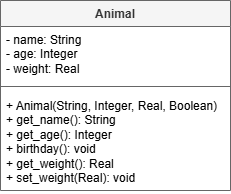

# AH SDD - Animals

A solution is need will model some of the important attributes of zoo animals, such as name, age, and weight.

## Design

The UML class diagram shown below.

### UML Class Diagram

## Implementation

Implement the Animal class.

## Testing

Design and implement tests for the Animal class.
