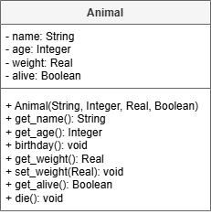

# AH SDD - Animals Part 2

## Design

The Animal class has had extra functionality added to it.

The updated UML diagram is shown below.

### UML Class Diagram

## Implementation

Update the Animal class to match UML class diagram.

## Testing

The Animal class can be tested using the following code.

Class test code: [animal_test.py](assets/animal_test.py "Download file")
