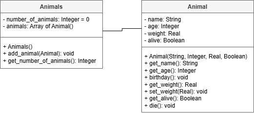

# AH SDD - Animals Part 3

A collection class has been design to help keep the Animal objects together.

## Design

The revised UML diagram is shown below.

### UML Class Diagram

## Implementation

Implement the Animals class.

## Testing

### Animals Class Testing

Design and implement tests for the Animals class.

### Animal Class Testing

The Animal class can be tested using the following code.

Class test code: [animal_test.py](assets/animal_test.py "Download file")