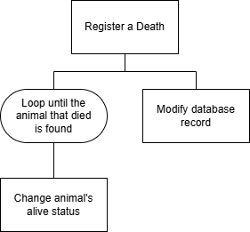
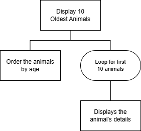
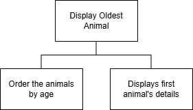
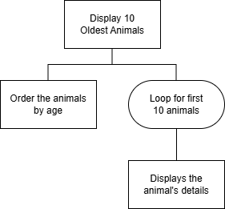
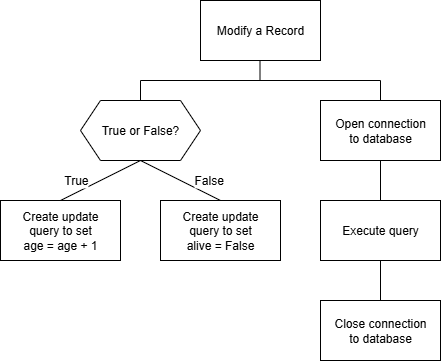

# AH SDD - Animals Part 6


## Design


### Data Dictionary


#### Entity: Animal

| Attribute   | Key   | Type    | Size  | Req'd | Validation |
| ---------   | :---: | ----    | :---: | :---: | ---------- |
| animal_id   | PK    | integer |       | Y     | Auto increment |
| name        |       | varchar | 20    | Y     | Unique |
| age         |       | integer |       | Y     | Range: >= 0 |
| weight      |       | float   |       | Y     | Range: >= 0.0 |
| alive       |       | boolean |       | Y     | |


### User Interface


#### Menu

```
Barra Zoo
---------

Menu:

  1 Display all animals
  2 Add a new animal
  3 Celebrate a birthday
  4 Register a death
  5 Display oldest animal
  6 Display 10 oldest animals
  
  x Exit
  
Enter choice: 
```


#### Display all animals

```
All Animals
------------

Animal No 1
    Name: Bonzo
    Age: 17
    Weight 15.4 kg
    Alive: False

Animal No 2
    Name: Goldie
    Age: 2
    Weight 0.1 kg
    Alive: True

...
```


#### Add a new animal

```
Add a New Animal
----------------

Name? Lassie
Age? 7
Weight? 21.2
Record added to Animal table.
```


#### Celebrate a birthday

```
Celebrate a birthday
--------------------

Which animal has a birthday? Lassie

Record modified in Animal table.
Happy birthday Lassie!
```


#### Register a death

```
Register a Death
----------------

Which animal died? Lassie
No animal called Lassie was found.

Record modified in Animal table.
Lassie's death has been registered.
```


#### Display oldest animal

```
Oldest Animal
--------------
Name: Ginge
Age: 10
--------------
```


#### Display 10 oldest animals

```
Ten Oldest Animals
-------------------

Animal No 1
    Name: Ginge
    Age: 10

Animal No 2
    Name: Moss
    Age: 5

Animal No 3
    Name: Fidget
    Age: 4
    
...
```


### UML Class Diagram


### Structure Diagram


#### Top-level Design


##### Display all animals


##### Add a new animal




##### Celebrate a birthday


##### Register a death




##### Display oldest animal




##### Display 10 oldest animals




##### Update record


