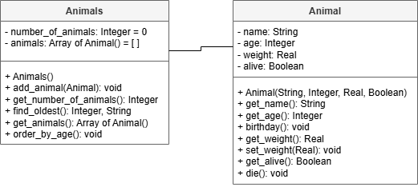
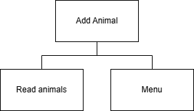

# AH SDD - Animals Part 6


## Design

### UML Class Diagram




### Structure Diagram





## Implementation

```
Barra Zoo
---------

Menu:

  1 Add an animal
  2 Register a death
  3 Display oldest animal
  4 Display 10 oldest animals
  5 Display all animals
  
  x Exit
  
Enter choice: 
```
