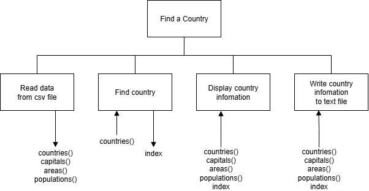

# AH SDD - Find a Country


## Design

A Structure Diagram is shown below.




## Implementation

Implement a soultion using the design.


### Starter Code

Starter code for `findCountry.py` is below.
The names of sub-programs are given, and must be used, but the input, process, and output is missing.

``` python
# Title:
# Author:
# Date:

def readData()

def findCountry()

def displayCountry()

def writeSummary()

def main()

# Run program
if __name__ == "__main__":

    main()
```

### Example use interface

```
Find a Country
--------------

Which country? Denmark

Result
------

Capital: Copenhagen
Area: 43094 km^2
Population: 5822763

======
```

### Example Summary File

```
Country Details
---------------

Country: Denmark
Capital: Copenhagen
Area: 43094 km^2
Population: 5822763

===============
```

## Testing

___TBC___
