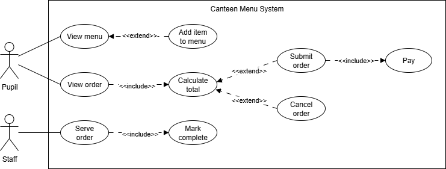
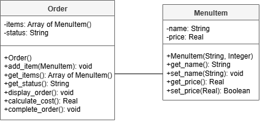
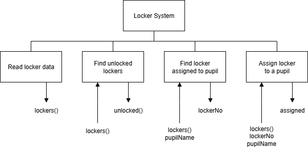

# AH SDD - Canteen Part 4


## Introduction

A secondary school plans to introduce a new ordering system for the canteen.
Pupils will use a large screen to view the menu.
Required items can be added to an order.
Pupils will be able to view their order, and the total will be displayed.
Pupils can then chose to cancel the order or submit it.
When an order is submitted, it is then paid.

When an order has been paid for, canteen will serve it to the pupil and mark the order complete.


### Lockers

Each locker has a small ePaper display on the locker to display the following information:

* a unique locker number
* who it is assigned to
* locked / unlocked

An example of a display is show below:

&nbsp;&nbsp;&nbsp;&nbsp;&#127380; 5  
&nbsp;&nbsp;&nbsp;&nbsp;&#129489; Pete Smith  
&nbsp;&nbsp;&nbsp;&nbsp;&#128273; Locked


### Staff

The app should allow staff to:

* lock a locker
* unlock a locker
* get the information about a locker (locker number, pupil name, and locked status)
* search for unlocked lockers
* search for the locker number(s) of a specific pupil
* assign a locker to a pupil


## Analysis


### End-User Requirements


#### Pupils

* EU1 - Pupils must be able to view a list of available canteen items.
* EU2 - Pupils must be able to add items to an order.
* EU3 - Pupils must be able to remove items from an order.
* EU4 - Pupils must be able to view the current order and total cost.
* EU5 - Pupils must be able to submit their order for processing.


#### Canteen Staff

* EU6 - Staff must be able to mark orders as completed.


### Functional Requiremnts

#### Input

FR1 - The system shall allow pupils to select items from a list of available canteen items.
FR2 - The system shall allow pupils to specify quantities for selected items.
FR3 - The system shall allow pupils to remove selected items from an order.
FR4 - The system shall allow pupils to submit an order.
FR5 - The system shall allow staff to access submitted orders.


#### Process
 
FR6 - The system shall store a list of available canteen items.
FR7 - The system shall store items added to an order as a collection of objects.
FR8 - The system shall calculate the cost of each order based on item price and quantity.
FR9 - The system shall update an order when items are added or removed.
FR10 - The system shall change the status of an order when it is submitted or processed.
FR11 - The system shall maintain a collection of all submitted orders.


#### Output

FR12 - The system shall display the list of available menu items.
FR13 - The system shall display the current contents of an order.
FR14 - The system shall display the total cost of an order.
FR15 - The system shall display all submitted orders to staff.
FR16 - The system shall display order details for staff processing (items, quantities, totals, status).


### UML Use Case Diagram

The analysis of the proposed system allowed a UML use case diagram to be created.




## Design


### UML Class Diagram

From the analysis, a class for Locker was designed.




### Top Level Design




#### Example UI

```
Smart Locker System
-------------------

Number of lockers read from file: 20

The following lockers are unlocked:

    5
    19

Locker 13 is assigned to Jodie Whittaker.

Locker 14 has been assigned to Ncuti Gatwa.
```


## Implementation


### Locker Class

From UML class diagram, the Locker class was implemented.

Class code: [Locker.py](assets/Locker.py "Download file")


### Locker Class Testing

The class was tested using the following code.

Class test code: [lockerTest.py](assets/lockerTest.py "Download file")


### Locker Data

The details of the all the lockers have been saved to a file.

Locker data: [Lockers.csv](assets/Lockers.csv "Download file")


## Tasks

1. Using the class and data provided, implement the top level design.
