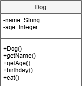

# AH SDD - A Dog's Life

## Introduction

Not everyone has the room for a dog, but everyone has space for a virtual dog!
A new firm, Vatersay Virtual Pet Service (VVPS) plans to develop a product that will fill a gap in the market.
VVPS will start with a prototype to test the feasabilty of the idea.

### Characteristics

VVPS has determined that the following characteristics are important:

* Each dog has a name and an age.
* On a dog's birthday, it will age 1 human year.
* A dog can eat anything, and will enjoy it.

## Design

### UML Class Diagram

From the analysis of the problem, a class for Dog was designed.

## Tasks

1. Implement the class.

2. Test the class.
