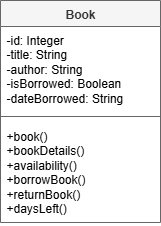

# AH SDD - Library Part 4


## Introduction

Castlebay School of Computing plans to install a self-service kiosk system to allow pupils to borrow and return books without needing staff assistance.

Each book in the system will have:

* a library number
* a title
* an author
* a status showing whether it is currently borrowed
* the name of the pupil who borrowed the book
* a status showing whether it is currently reserved


### Pupil

The system should allow a pupil to:

* search for books by title or author
* view information about a book
* view whether a book is currently available
* borrow a book
* return a book
* reserve a book if it is currently unavailable

Before borrowing or returning a book, a pupil must enter their pupil ID.

When a pupil borrows a book, the system should:

* update the book status to unavailable
* record the pupil's name

When a pupil returns a book, the system should:

* update the book status to available

If a book is unavailable, the system should allow a pupil to reserve it.


## Analysis


### End-User Requirements

The following end user requiremnts were identified:

* EU1 - The system should allow pupils to search for books by title.
* EU1 - The system should allow pupils to search for books by author.
* EU1 - The system should allow pupils to view information about a book.
* EU1 - The system should allow pupils to check whether a book is available.
* EU1 - The system should allow pupils to borrow books.
* EU1 - The system should allow pupils to return books.
* EU1 - The system should allow pupils to reserve books that are unavailable.
* EU1 - The system should require pupils to enter their pupil ID before borrowing a book.
* EU1 - The system should require pupils to enter their pupil ID before returning a book.


### Functional Requiremnts

The following functional requiremnts were identified:

* FR1 - The system shall store a library number for each book.
* FR1 - The system shall store a title for each book.
* FR1 - The system shall store an author for each book.
* FR1 - The system shall store the availability status of each book.
* FR1 - The system shall store the name of the pupil who borrowed a book.
* FR1 - The system shall allow books to be searched by title.
* FR1 - The system shall allow books to be searched by author.
* FR1 - The system shall display information about a selected book.
* FR1 - The system shall display whether a selected book is available.
* FR1 - The system shall allow a pupil to enter their pupil ID.
* FR1 - The system shall validate a pupil ID before a book can be borrowed.
* FR1 - The system shall validate a pupil ID before a book can be returned.
* FR1 - The system shall update a book's status to unavailable when it is borrowed.
* FR1 - The system shall record the pupil's name when a book is borrowed.
* FR1 - The system shall update a book's status to available when it is returned.
* FR1 - The system shall allow a pupil to reserve a book if it is unavailable.
* FR1 - The system shall record reservations for unavailable books.


### UML Use Case Diagram

The analysis of the proposed system allowed a UML use case diagram to be created.


## Design


### UML Class Diagram

From the analysis, a class for Locker was designed.




### Top Level Design


#### Example UI

```
Smart Locker System
-------------------

Number of books read from file: 20

The following lockers are unlocked:

    5
    19

Books by Homer:

    The Iliad
    The Odyssey

Locker 14 has been assigned to Ncuti Gatwa.
```


## Implementation


### Locker Class

From UML class diagram, the Locker class was implemented.

Class code: [Locker.py](assets/Locker.py "Download file")


### Locker Class Testing

The class was tested using the following code.

Class test code: [lockerTest.py](assets/lockerTest.py "Download file")


### Locker Data

The details of the all the lockers have been saved to a file.

Locker data: [Lockers.csv](assets/Lockers.csv "Download file")


## Tasks

1. Using the class and data provided, implement the top level design.
