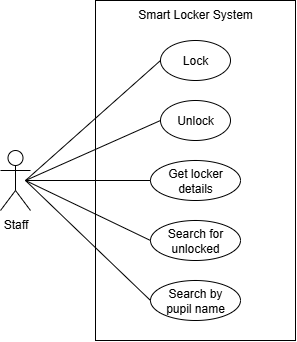
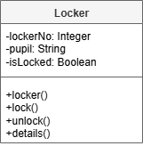

# AH SDD - Lockers Part 3

## Introduction

A secondary school plans to introduce a new locker system for pupils.
Each pupil will be assigned a locker where they can safely store their belongings during the school day.

The lockers will be smart, meaning that they can be controlled via software.
A program will be required that will allow a member of staff to manage individual lockers via an app.

### Lockers

Each locker has a small ePaper display on the locker to display the following information:

* a unique locker number
* who it assigned to
* locked / unlocked

An example of a display is show below:

&nbsp;&nbsp;&nbsp;&nbsp;&#127380; 5  
&nbsp;&nbsp;&nbsp;&nbsp;&#129489; Pete Smith  
&nbsp;&nbsp;&nbsp;&nbsp;&#128273; Locked

### Staff

The app should allow staff to:

* lock a locker
* unlock a locker
* get the information about a locker (locker number, pupil name, and locked status)
* search for unlocked lockers
* search for the locker number of a specific pupil

## UML Use Case Diagram

The analysis of the proposed system allowed a UML use case diagram to be created.

## UML Class Diagram

From the analysis, a class for Locker was designed.

## Tasks

1. Implement the class.

2. Implement functions for the search use cases.
