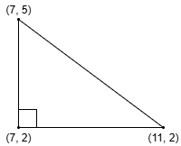
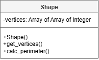

# AH SDD - Shape

## Introduction

The maths department has had enough of people not being able to calculate the perimeter of a shape from its coordinates.
Therefore, it has been decided to create a digital solution that pupils can use to check their answers.

### Example Shape

An example of a shape and its coordinates are shown below.

### Characteristics

The following characteristics are important:

* The coordinates of the vertices (corners)
* Calculating the perimeter of a shape

## Design

### UML Class Diagram

From the analysis of the problem, a class for Shape was designed.

## Tasks

1. Implement the class.

2. Test the class.
