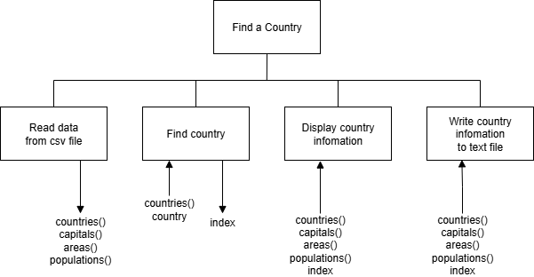

# AH SDD - Find a Country


# Introduction

A data file ([countries.csv](assets/countries.csv "Download file")) countains the data for a number of countries (name, capital, area, and population).
The countries are in alphabetical order.
The data will be used to extract the information about one country.
The information will be displayed to the user, and written to a file called `country.txt`.


## Design

A Structure Diagram is shown below.




## Implementation

Implement a soultion using the design.


### Starter Code

Starter code for `find_country.py` is below.
The names of sub-programs are given, and must be used, but the input, process, and output is missing.

``` python
# Title:
# Author:
# Date:

def read_data()

def find_country()

def display_country()

def write_summary()

def main()

# Run program
if __name__ == "__main__":

    main()
```

### Example User Interface

```
Find a Country
--------------

Which country? Denmark

Result
------

Capital: Copenhagen
Area: 43094.0 km^2
Population: 5822763

======
```

### Example Summary File

```
Country Details
---------------

Country: Denmark
Capital: Copenhagen
Area: 43094.0 km^2
Population: 5822763

===============
```

## Testing

Run the file [find_country_test.py](assets/find_country_test.py "Download file").
The file must be in the same folder as `find_country.py`.
