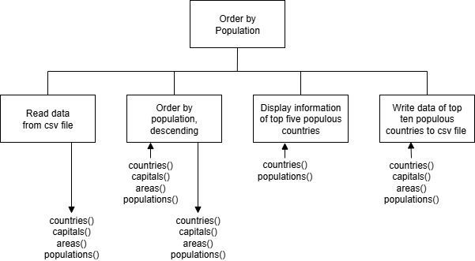

# AH SDD - Order by Population


# Introduction

A data file ([countries.csv](assets/countries.csv "Download file")) countains the data for a number of countries (name, capital, area, and population).
The countries are in alphabetical order.


## Design

A Structure Diagram is shown below.




## Implementation

Implement a soultion using the design that will:

1. Display the information about the five most populous countries.
2. Write the data of the ten most populous countries to a file called `top_populations.csv`.


### Starter Code

Starter code for `order_population.py` is below.
The names of sub-programs are given, and must be used, but the input, process, and output is missing.

``` python
# Title:
# Author:
# Date:

def read_data()

def order_population()

def display_top_5()

def write_top_10()

def main()

# Run program
if __name__ == "__main__":

    main()
```

### Example use interface

```
Top 5 by Population
-------------------

1.
  Country: Russia
  Population: 146171015

2.
  Country: Turkey
  Population: 85279553

3.
  ...

===================
```

### Example Data File

```
country,capital,area,population
Russia,Moscow,17098242.0,146171015
Turkey,Ankara,783356.0,85279553
...

```

## Testing

Run the file [order_population_test.py](assets/order_population_test.py "Download file").
The file must be in the same folder as `order_population.py`.
