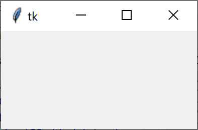

# Python Graphical User Interface - Tkinter


## Create a blank GUI

``` python
# Get extra code
from tkinter import *

# Create a window - First task
window = Tk()

# Display the window - Last task
window.mainloop()
```




## Widgets

Widgets are added to the GUI in two stages:

* Create the widget
* Add the widget

### Creating a Widget


### Adding a Widget


### Add a Label

``` python
# Get extra code
from tkinter import *

# Create a window - First task
window = Tk()


# Create a Label
label = Label(master=window, text="A label")

# Add the label to the window
label.pack()


# Display the window - Last task
window.mainloop()
```
