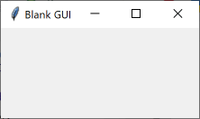
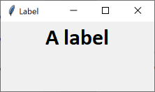
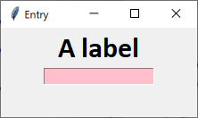
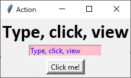

# Python Graphical User Interface - Tkinter


## Create a blank GUI

``` python
# Get extra code
import tkinter as tk

# Create a window - First task
window = tk.Tk()

# Set the initial width and height
window.geometry("220x100")

# Name the window
window.title("Blank GUI")


#
# Widget(s) go here
#


# Display the window - Last task
window.mainloop()
```




## Widgets

Widgets are added to the GUI in two stages:

1. Create the widget
2. Add the widget


### Creating a Widget

Widgets can be created with a number of parameters:

* `master`: what it will be added to.  Can be another widget.
* `text`: the text to be displayed.
* `font`: text style and size
* `fg`: text colour.
* `bg`: background colour.
* `command`: function to be called.

Not every parameter works with every widget.


### Adding a Widget

There are different methods to add widgets to the GUI, and some parameters can be used with all of them:

* `padx`: extra padding to the left and right.
* `padx`: extra padding above and below.

The `pack()` method is a specific way to add the widgets, which is from top to bottom.


## Code

### Add a Label

``` python
# Create a Label
label = tk.Label(master=window, text="A label", font="Calibri 24 bold")

# Add the label to the window
label.pack()
```




### Add an Entry Field

``` python
# Create an entry field
entry = tk.Entry(master=window, fg="blue", bg="pink")

# Add the entry field to the window 
entry.pack()
```




### Add a Button

``` python
# Create a button
button = tk.Button(master=window, text="Click me!", border=5)

# Add the button to the window 
button.pack(pady=5)
```


### Add an Action to the Button

Create a function.

``` python
def buttonClick():
    """Copies text from the entry field to the label."""
    
    # Get the entry field text
    text = entry.get()
    
    # Change the label text
    label["text"] = text
```

Update the button to add the function.

``` python
button = tk.Button(master=window, text="Click me!", border=5, command=buttonClick)
```


