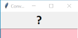
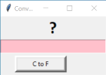
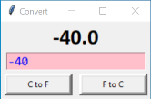

# Tkinter - Grid Method


## Create a blank GUI

``` python
# Get extra code
import tkinter as tk

# Create a window - First task
window = tk.Tk()

# Name the window
window.title("Convert")


#
# Widget(s) go here
#


# Display the window - Last task
window.mainloop()
```


## Widgets

### Adding a Widget

`grid()` method parameters:

* `row`: position
* `column`: position
* `rowspan`: how many rows to be used, if more than 1.
* `columnspan`: how many columns to be used, if more than 1.


## Code

### Add a Label and Entry Field

``` python
# Create a Label
label = tk.Label(master=window, text="?", font="Calibri 24 bold")

# Add the label to the window
label.grid(row=0, column=0, columnspan=2)

# Create an entry field
entry = tk.Entry(master=window, fg="blue", bg="pink", font="Consolas 14")

# Add the entry field to the window 
entry.grid(row=1, column=0, columnspan=2)
```




### Add a Button

When lines of code become too long, they can be broken up over different lines, if within brackets `( )`.

``` python
# Create C to F button
buttonC = tk.Button(master=window,
                    text="C to F",
                    border=5,
                    width=12, 
                    command=convertC)

# Add the button to the window 
buttonC.grid(row=2, column=0, padx=5, pady=5)
```


#### Create the function

``` python
def convertC():
    """Convert centigrade to Fahrenheit to 1 dp."""
    
    # Get the entry field text
    degC = float(entry.get())
    
    # Convert C to F
    degF = round(degC * (9/5) + 32, 1)
    
    # Change the label text
    label["text"] = degF
```




### Add a Another Button

``` python
# Create F to C button
buttonF = tk.Button(master=window,
                    text="F to C",
                    border=5,
                    width=12,
                    command=convertF)

# Add the button to the window 
buttonF.grid(row=2, column=1, padx=5, pady=5)
```

#### Create the function

``` python
def convertF():
    """Convert Fahrenheit to centigrade to 1 dp."""
    
    # Get the entry field text
    degF = float(entry.get())
    
    # Convert C to F
    degC = round((degF - 32) * (5/9), 1)
    
    # Change the label text
    label["text"] = degC
```


