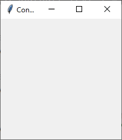
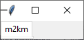
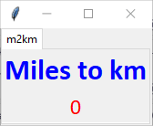
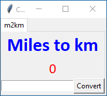
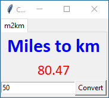
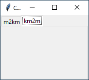
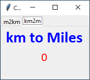
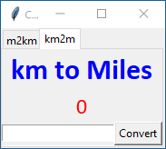
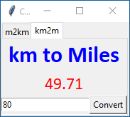

# Tkinter - Tabs


## Create a blank GUI

``` python
# Get extra code
import tkinter as tk
from tkinter import ttk  # used for tabs

# Create a window - first task
window = tk.Tk()

# Name the window
window.title("Convert")

# Set the initial position: x and y
window.geometry("+300+200")


#
# Widget(s) go here
#


# Display the window - Last task
window.mainloop()
```




## Widgets

### Adding a Widget

`grid()` method parameters:

* `row`: position
* `column`: position
* `rowspan`: how many rows to be used, if more than 1.
* `columnspan`: how many columns to be used, if more than 1.


## Code

### Add a Notebook

A notebook is used as tabs can be added to it.

``` python
# Create notebook for tabs
notebook = ttk.Notebook(master=window)

# Add notebook to window - top left
notebook.pack(side="left", anchor="nw")
```


### Add First Tab

``` python
# Create first tab and add to notebook
m2kTab = tk.Frame(master=notebook)

notebook.add(m2kTab, text="m2km")
```




### Add Labels to Tab

``` python
# Create title label and add to 1st tab
m2kLbl = tk.Label(master=m2kTab,
                  text="Miles to km",
                  fg="blue",
                  font="Calibri 24 bold")

m2kLbl.pack()

# Create output label and add to 1st tab
kmOutput = tk.Label(master=m2kTab,
                    text="0",
                    fg="red",
                    font="Calibri 18")

kmOutput.pack()
```




### Add an Input Area

``` python
# Create input area and add to 1st tab
m2kFrame = tk.Frame(master=m2kTab)

m2kFrame.pack()
```


### Add Entry Field and Button

``` python
# Create entry field and add to input area
milesInput = tk.Entry(master=m2kFrame)

milesInput.pack(side="left")


# Create button and add to input area
m2kBtn = tk.Button(master=m2kFrame,
                   text="Convert",
                   command=convertm2km)

m2kBtn.pack(side="left")
```




#### Create the function

``` python
def convertm2km():
    """Convert miles to kilometres, to 2 decimal places."""
    
    # Get miles value
    miles = milesInput.get()
    
    # Calculate result
    if len(miles) > 0:
        km = str(round(float(miles) * 1.609344, 2))
    else:
        km = "0"
    
    # Display result
    kmOutput["text"] = km
```




### Add Second Tab

``` python
# Create second tab 2 and add to notebook
tab2 = tk.Frame(master=notebook)

notebook.add(tab2, text="km2m")
```




### Add Labels to Tab

``` python
# Create title label and add to 2nd tab
title2 = tk.Label(master=tab2,
                  text="km to Miles",
                  fg="blue",
                  font="Calibri 24 bold")

title2.pack()

# Create output label and add to 2nd tab
milesOutput = tk.Label(master=tab2,
                       text="0",
                       fg="red",
                       font="Calibri 18")

milesOutput.pack()
```




### Add an Input Area

``` python
# Create input area and add to 2nd tab
inputArea2 = tk.Frame(master=tab2)

inputArea2.pack()
```


### Add Entry Field and Button

``` python
# Create entry field and add to input area
kmInput = tk.Entry(master=inputArea2)

kmInput.pack(side="left")


# Create button and add to input area
k2mBtn = tk.Button(master=inputArea2,
                     text="Convert",
                     command=convertkm2m)

k2mBtn.pack(side="left")
```




#### Create the function

``` python
def convertkm2m():
    """Convert kilometres to miles, to 2 decimal places."""
    
    # Get km value
    km = kmInput.get()
    
    # Calculate result
    if len(km) > 0:
        miles = str(round(float(km) / 1.609344, 2))
    else:
        miles = "0"
    
    # Display result
    milesOutput["text"] = miles
```

