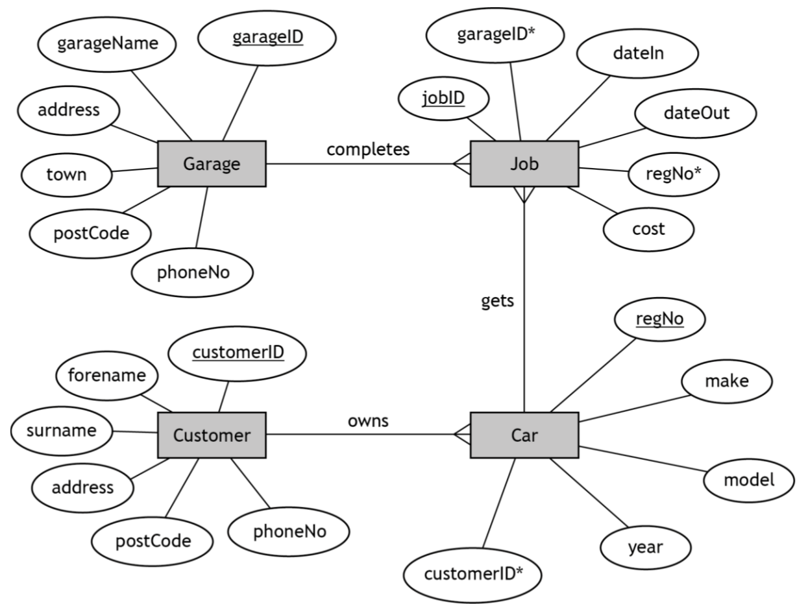

# H CS 2020 Task 1 Part C - Extension

### Database design and development

#### Entity-relationship diagram 

## Extension Questions

* For each of the following questions write and test the SQL required to create the described output.

* Each question involves two steps so will require two separate SQL statements.

* Make sure you create aliases where appropriate.

### Questions

___1d(i)___ The customer who had the most expensive car repair is to be sent a £50 voucher off their next repair.  Display the full name, address and car registration of this customer.  (__4 marks__)

___1d(ii)___ The company wish to find the make and model of the cars that are the cheapest to repair.  Find the cost of the cheapest repair and then display the car make and model of any car whose repair cost less than £20 more than the cheapest repair.  (__4 marks__)

___1d(iii)___ Find the number of jobs completed by each garage.  Display the name of any garages that have less than 15 jobs in the database.  (__4 marks__)

___1d(iv)___ Find the number of customers each garage has carried out repairs for and display the largest number of customers found.  (__4 marks__)