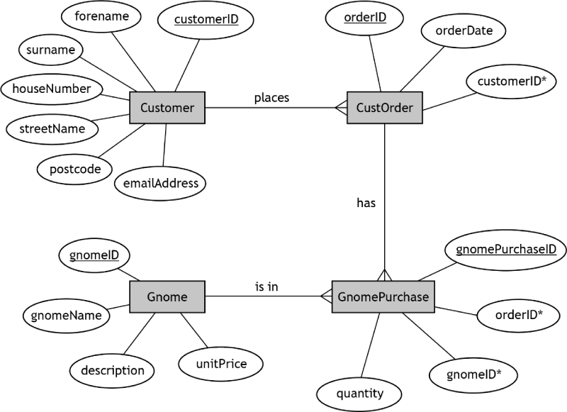

# H CS 2023 - Task 2 Part B


File: [GnomeSales.db](assets/GnomeSales.db "Download")


## Introduction

Gnome Sweet Gnome is a company that sells garden gnomes.


# Entity relationship diagram

Following further analysis, the entity-relationship diagram below is created.



This design is then implemented.

This is a relational database with the following tables. 


## gnomeSales database

| Customer          | CustOrder      | GnomePurchase          | Gnome |
| --------          | ---------      | -------------          | ----- |
| <u>customerID</u> | <u>orderID</u> | <u>gnomePurchaseID</u> | <u>gnomeID</u> |
| forename          | orderDate      | orderID*               | gnomeName |
| surname           | customerID*    | gnomeID*               | description |
| houseNumber       |                | quantity               | unitPrice |
| streetName        |                |                        | |
| postcode          |                |                        | |
| emailAddres       |                |                        | |


___2b___  Gnome Sweet Gnome would like to produce a list showing the number sold for each gnome with the word 'solar' in the description. 

Implement the SQL statement to produce the following output.

(__5 marks__)

| gnomeName  | Total gnomes sold |
| ---------  | ----------------- |
| Coimin     | 21 |
| Maximilian | 19 |
| Danny      | 15 |
 
Print evidence of the implemented SQL statement and the output produced. 


___2c___  A discount voucher will be sent to customers who bought three or more of the most 
expensive gnome available, in a single order.

Implement the SQL statement(s) to produce the output shown below.

(__4 marks__)

| emailAddress                 | orderID | Quantity |
| ------------                 | ------- | -------- |
| melina.santiago@coolmail.com | ord0061 | 5 |
| maha.weber@yeehaa.com        | ord0097 | 4 |

Print evidence of the implemented SQL statement(s) and the output produced. 


___2d___  A query is designed to add 20% VAT to all orders.
The query is tested using order ord0024.
The expected output is shown below.

Note: the database environment you use might output the total as 248.4
 
| forename | surname | Total to Pay (£) |
| -------- | ------- | ---------------- |
| Sandy    | Kerr    | 248.40 |

The SQL statement shown below is implemented.

```
SELECT forename, surname, (quantity*unitPrice*1.2) AS [Total to Pay £]
FROM Customer, Gnome, GnomePurchase, CustOrder
WHERE CustOrder.orderID = "ord0024" 
AND Customer.customerID = CustOrder.customerID 
AND CustOrder.orderID = GnomePurchase.orderID 
AND Gnome.gnomeID = GnomePurchase.gnomeID; 
```

The query to test the above SQL statement is provided with the database.
When run, the actual output does not match the expected output.

Amend the query to produce the expected output as shown above.

(__2 marks__)

Print evidence of the amended SQL query and the output produced.


___2e___  A customer requests a copy of a previous order for an insurance claim.

Evaluate the accuracy of output when running a new query to produce a copy of the original order by:

___(i)___ explaining why the copy of the order may not reflect the price paid at the time 

(__1 mark__)

___(ii)___ describing how the database could be amended to rectify this

(__1 mark__)
