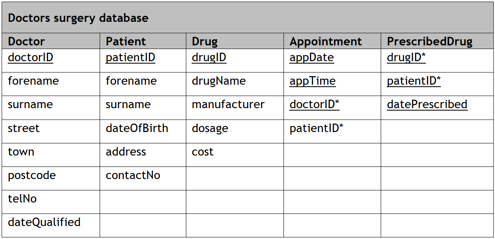

# H CS 2018S - Task 1 Part B


[Doctors surgery database](assets/Surgery.db)





___1c(i)___ The surgery wants to create a list of drugIDs showing how many times each drugID is prescribed.
The list should be sorted from the most prescribed drug to the least.

Implement the SQL statement that will produce this output.

Print evidence of both the implemented SQL statement and the output it produced. (__3 marks__)


___1c(ii)___ The surgery wants to identify a list of patients who have been prescribed the drug with the highest dosage.

The output should include the patientID and the datePrescribed fields, as shown 
below. 

| patientID | datePrescribed |
| --------- | -------------- |
| 75        | 2018-05-14 |
| 88        | 2018-05-14 |
| 92        | 2018-05-10 |
| …         | … |

Implement two SQL statements that will produce this output.

Print evidence of both the implemented SQL statements and the outputs they produced. (__4 marks__)


___1d___ The five patients listed below live in the postcode area EH12:

* Susan Lamb
* Gifty Adisa
* Lewis Robinson
* Morgane Dubios
* Toby Malone

The following SQL statement is designed to find all the patients who live within this postcode area.
 
```SQL
SELECT forename, surname, patientID
FROM Patient
WHERE address LIKE '%EH12%';
```

Test the above SQL statement.  

Comment on any difference between the actual output it produces and the expected output. (__1 mark__) 

Describe how the Patient table could be changed to ensure the expected output matches the actual output. (__1 mark__)
