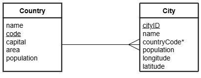

# H DDD Aggregate Functions Part 3

File: [Clydeview.db](../H-DDD-Clydeview/assets/Clydeview.db "Download file")

## Entity Relationship Diagram (ERD)

The tables called `Country` and `City` are shown below.

## Tasks

Use SQL queries to display each set of required details.  Aliases should be used.

1.  List the largest, smallest and average area of all the countries (the average should be rounded to 1 decimal place).
2.  List the number of countries that have an area over one million kilometres squared.
3.  List the combined area of all countries with a name that starts with `D`.
4.  List the combined population of all the cities located in Germany.
5.  List each country code together with the total population of the cities in that country.  The only country codes listed should be those that have exactly two letters ending with the letter `A`.
6.  List the total population of the capital cities of any country that has the pattern `AM` in its country name.
7.  List the name of each country that has at least two words in its name together with the combined population of the cities in each country.  The only countries that should be listed are those with a total country population which is over 11 million.
8.  List the name of each country and the number of cities in that country (the countries that are listed should be those that contain the letter `i` somewhere in the name of the country which also ends with the letter `a`).  This list of countries should be displayed in descending order of number of cities; where this is equal, the results should be displayed in alphabetical order of country name.
