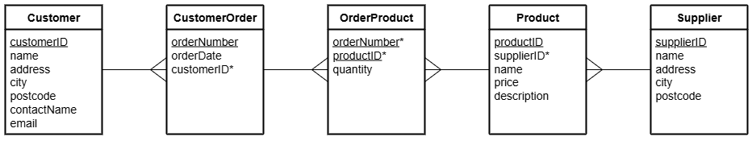

# H DDD Aggregate Functions Part 4

File: [Clydeview.db](../H-DDD-Clydeview/assets/Clydeview.db "Download file")

## Entity Relationship Diagram (ERD)

The tables called `Customer`, `CustomerOrder`, `OrderProduct`, `Product`, and `Supplier` are shown below.

## Tasks

Use SQL queries to display each set of required details.

1.  List the name of each supplier together with the average price of the products that they supply (round the average to 2 decimal places).
An example of the expected output is shown below.

    | name          | Avg Price |
    | ----          | --------- |
    | Bears R Us    | 8.99 |
    | Dolls House   | 4.62 |
    | Fun and Games | 9.49 |

{:start="2"}
2.  List the name of each customer together with the largest and the average number of products ordered by the shop (round the average to 1 decimal place).
3.  List the name of each customer and the number of orders that the shop has placed.
The shop with the largest number of orders should be listed first; shops with the same number of orders should be listed alphabetically.
4.  List each order number together with the number of different products ordered in each order.
5.  List the name of each supplier together with the total value of the products that they supply.  These details should be listed from largest to smallest value.
6.  List the name of each product that has been ordered with the combined total quantity of the product that has been ordered.
The products should be listed from largest combined total to smallest; products with the same combined total should be listed alphabetically by product name.
7.  List the name of each customer and the total number of bears that have been ordered by the shop.
The shop that has ordered the smallest number of bears should be listed first.
An example of the expected output is shown below.

    | name          | Bears |
    | ----          | ----- |
    | The Toy Store | 5 |
    | Fun4All       | 90 |
    | Village Toys  | 200 |

{:start="8"}
8.  List the name of each customer, the order number of any orders placed by the shop, the date and the total cost of those orders.
Arrange these details in alphabetical order of shop name; where a shop has placed two or more orders, the most recent order should be listed first.
An example of the expected output is shown below.

    | name          | orderNumber | orderDate  | Value |
    | ----          | ----------- | ---------  | ----- |
    | Fun4All       | 20006       | 2018-12-01 | 329.6 |
    | Fun4All       | 20007       | 2018-01-30 | 2196.0 |
    | The Toy Store | 20008       | 2018-03-02 | 219.6 |
    | Village Toys  | 20009       | 2018-08-02 | 3367.5 |
    | Village Toys  | 20005       | 2018-01-05 | 1798.0 |
