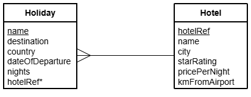

# H DDD Aggregate Functions Part 4

File: [Clydeview.db](../H-DDD-Clydeview/assets/Clydeview.db "Download file")

## Entity Relationship Diagram (ERD)

The tables called `Holiday` and `Hotel` are shown below.

## Tasks

Create SQL queries to display the required details.
An alias should be used to display a meaningful heading for any computed values displayed.

1.  Display the name, destination, country and distance from the airport of the hotel that is furthest from the airport.
2.  Display the name and star rating of any hotel with a rating that is poorer than the average star rating of all the holidays that have the word 'Break' or 'Package' in their title.
The hotel with the highest star rating should be listed first; hotels with the same star rating should be listed in alphabetical order of hotel name.
3.  Display the name, city and price per night of any hotel which is dearer that the dearest hotel in Edinburgh.
List the hotel details with the dearest hotel first; hotels with the same price should be listed in alphabetical order of city.
4.  Display the number of holidays that have the same star rating as that of the 'Der Wald' hotel.
5.  Display the name, city, and distance from the airport of any holiday to Lisbon that is closer to the airport than the average distance from the airport of all the hotels in Spain.
6.  Display the name, departure date and duration of any holiday that has the same duration as the longest holiday to a city with the letter 'o' as the second character of the city name.
Arrange these details so that the most recent holiday is listed first.
