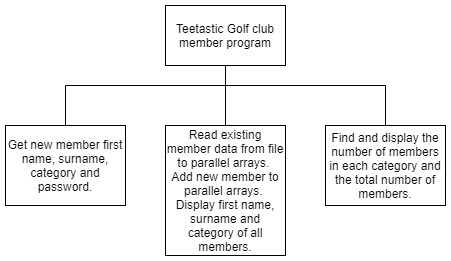

# H CS 2020 Task 2 Part B


File: [members.txt](assets/members.txt "Download") (Right click: `Save link as ...`)


Teetastic Golf Club has a maximum of 50 members.
It would like to develop a program to manage the information of existing and new members.


## Purpose
When a new member visits the golf club, an administrator enters the member’s first name, surname and category of membership into the program. During this process, the new member enters a password that is stored along with their details. The password is then validated to ensure that it meets password strength requirements.

The program reads the existing member data from a text file and the new member’s details are added to the existing member details. Details of all members are then displayed.

The program can find and display the number of members in each category (junior, adult or senior) and the total number of members.


## Functional requirements


### Inputs

* new member first name, surname, category and password from keyboard
* existing member first name, surname, category and password from file


### Processes

* validate password
* store each member’s details in appropriate data structures
* find the number of members in each category (junior, adult or senior)
* find the total number of members


### Outputs

* display name, surname and category of all members
* display the number of members in each category
* display the total number of members

There is no requirement to write data back to file.

The design for the Teetastic Golf Club member program is shown below.




### Program top level design (pseudocode)

```
1. Get new member first name, surname,          OUT: first name, surname, category, password
category and password.

2. Read existing member data from file to       IN: first name, surname, category, password
parallel arrays.  Add new member data to
parallel arrays.  Display first name, surname   OUT: category()
and category of all members.

3. Find and display the number of members in
each category and the total number of members.  IN: category()
```

### Refinements

```
1.1  Get first name
1.2  Get surname
1.3  Get category
1.4  Call function to get a valid password   OUT: password

     1.4.1  Loop until password is valid
     1.4.2      Ask the user to enter a password
     1.4.3      Check that the first character is a capital letter (ASCII values 65 to 90)
     1.4.4      Check that the last character is #, $ or % (ASCII values 35 to 37)
     1.4.5  Return a valid password

2.1  Read existing member data from file into four parallel arrays:
         firstName(), surname(), category(), password()
2.2  Add the new member data to the existing member data in the parallel arrays
2.3  Display the first name, surname and category of all members
```

The file `members.txt` contains the data for 10 existing members of the club. The maximum number of members is 50.

___2c___ Using the data flow, refinements and the information provided, implement the program in a language of your choice. Your programming language may need you to initialise variables before step 1 of the design.

Your fully completed program should:

* use a procedure to get new member data
* use a function to validate and return the new member password
* use a procedure to read existing member data from file, add new member data to parallel arrays, display member details and return the category array
* use a procedure to find and display the number of members in each category and the total number of members
* match the top level design provided
* be maintainable and modular

Check that your program is working by adding the following new member data.

```
Oliver Wilson, Adult, Ninjago$
```

The expected output from the finished program is shown below.

```
Our members are:
Angela Rich Adult
Siraj Adkins Junior
Stefano Love Senior
Cameron Wilder Junior
Griff Sutherland Adult
Amaan Sosa Senior
Isaak Schroeder Junior
Nana Galloway Junior
Lila Blanchard Adult
Eren Acosta Adult
Oliver Wilson Adult  
There are currently 5 Adult members
There are currently 4 Junior members
There are currently 2 Senior members
Total current membership is 11
```

(__15 marks__)

Print evidence of:

* your program code
* the program output showing the new member data

Ensure your name and candidate number is on all evidence.

___2d___ Describe how the function being used to validate the password could be comprehensively tested.

Your answer should make reference to your code. (__2 marks__)

___2e___ With reference to your own program code, evaluate:

* the efficiency of your program (__1 mark__)
* the robustness of your program (__1 mark__)
* the fitness for purpose of your program (__1 mark__)
