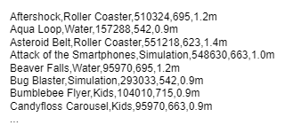
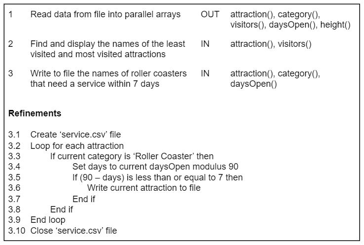
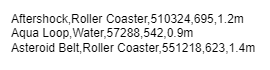
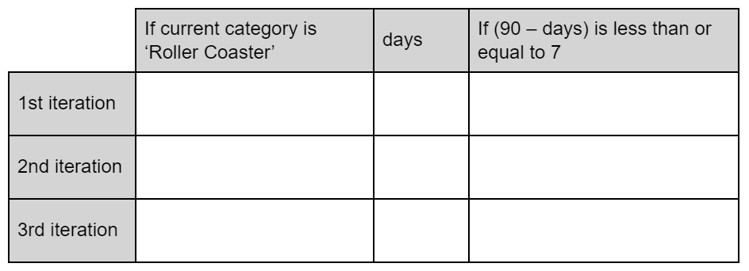

# H CS 2023 - Task 1 Part B

File: [attractions.csv](assets/attractions.csv "Download file")

## Problem description

The manager of a theme park would like a program to provide him with data on the park’s 26 attractions.

## Purpose

The program is required to read the attraction data from a CSV file into parallel arrays. The file contains the attraction name, category of attraction, total number of visitors, number of days open and the height restriction. 

The program will find the names of the least visited attraction(s) and the most visited attraction(s). 

Attractions in the category ‘Roller Coaster’ are serviced every 90 days. The program is required to calculate the number of days until the next service. It will use this information to produce an output that identifies all roller coasters that need to be serviced within the next 7 days.

## Assumptions

* the CSV data file is formatted correctly, is error-free and is updated every day

An example of the data in the file is shown below:

 

## Design

The design for the program is shown below.

__1c(i)__ Using the problem description and design, implement the program in a language of your choice.

Your program should:

* read data from the `attractions.csv` file and store into parallel arrays
* find and display the name(s) of the:
    * least visited attraction(s)
    * most visited attraction(s)
* write the names of roller coasters that require a service within 7 days to ‘service.csv’
* be maintainable and modular

(___12 marks___)

__1c(ii)__ The theme park’s manager wants an update on attractions with a height restriction of 1.0m and above. Height restrictions range from 0.9m to 1.4m. 

Implement a new sub-program to count and display the number of attractions with a height restriction beginning with the character ‘1’.

(___3 marks___)

Print evidence of:

* your program code
* program outputs from __1c(i)__ and __1c(ii)__
* the ‘service.csv’ file

__1d__ The sub-program ‘Write to file the names of roller coasters that need a service within 7 days’ is tested using the sample data below. 

Complete the trace table below to show the values up to the end of the third iteration. 

(___3 marks___)

		

__1e__	A new attraction is added to the theme park and the CSV file now has data for 27 attractions. 

Evaluate the maintainability of your first sub-program ‘Read data from file into parallel arrays’, with reference to data structures and loops, based on this change. 

(___2 marks___)
