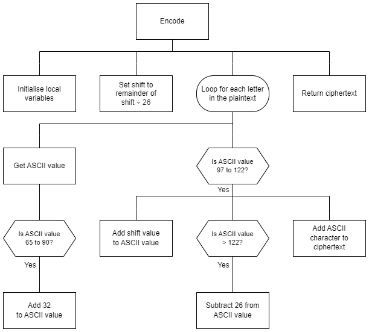

# H SDD - Caesar Cipher Part 1


## Introduction

A Caesar cipher is a simple shift cipher.  Each letter of a plaintext message is shifted a set number of places.

With a shift of 3, __a__ becomes __d__, and __m__ becomes __p__.  The end of the alhpabet wraps around to the beginning.

Julius Caesar used the cipher to encrypt messages over 2,000 years ago but today it can be quickly decrypted without knowing the shift key.


## Task

Use the structure diagram to create a sub-program that will encrypt a plaintext message and return the ciphertext.

All punctuation and spaces are ignored.  The ciphertext will be lowercase.

Save the code as `caesar.py`.


## Structure diagram

  


## Examples

### Example 1

#### Code
``` python
encode("Hello!", 1)
```

#### Output
```
'ifmmp'
```

### Example 2

#### Code
``` python
encode("abc XYZ", 29)
```

#### Output
```
'defabc'
```

## Testing

Run the file [Caesar-Test.py](assets/Caesar-Test.py "Download file") and choose 'Encode test'.  The file must be in the same folder as `caesar.py`.
