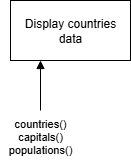

# H SDD - Parallel Arrays


## Skeleton code

``` python
# Title: 
# Author: 
# Date: 

#
# Sub-programs
#


#
# Main program
#

# Global variables

# Countries
capitals: list[str] = ["London", "Paris", "Berlin", "Oslo", "Madrid", "Rome"]
countries: list[str] = ["UK", "France", "Germany", "Norway", "Spain", "Italy"]
populations: list[float] = [66.8, 67.4, 83.2, 5.4, 46.8, 60.5]


# Pupils
forenames: list[str] = ["Aimee", "Stewart", "Aonghas", "James", "Kieran", "Callum", "Darren"]
surnames: list[str] = ["Campbell", "Ford", "MacDonald", "Smyth", "Young", "Robertson", "Walker"]
ages: list[int] = [17, 14, 16, 17, 13, 14, 12]
```


## Tasks

### Countries data

Create a sub-program to create the following output for

```
Countries Data
--------------

The capital of UK is London.
The population of UK is 66.8 million.

The capital of France is Paris.
The population of France is 67.4 million.

...

==============
```
 
#### Structure diagram


