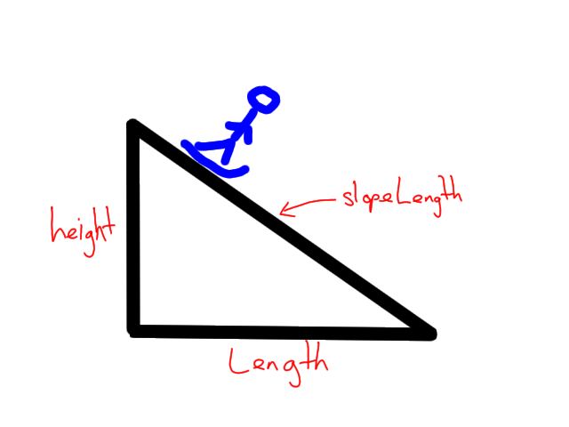

# H SDD - Ski Slope


## Introduction

Barra Ski Slopes (BSS) design ski slopes for all around the world.  When designing a new slope BSS is provided with the maximum height and length that the slope can be.  BSS then calculates the following values:

* Slope length
* Slope gradient
* Slope grade

Currently, these values are manually calculated.




## Task

You have been contracted by BSS to produce a solution that will automate the calculations.  During the design stage, five distinct sub-tasks were identified.


## Top level design (Pseudocode)

```
1. Ask the user for the height and length
   of the slope                               OUT: height, length

2. Calculate the slope length                 IN: height, length
   to 2 decimal places                        OUT: slopeLength
   
3. Calculate the gradient of slope            IN: height, length
   to 2 decimal places                        OUT: gradient

4. Classify the slope                         IN: gradient
                                              OUT: grade

5. Display the results                        IN: slopeLength, gradient, grade
```


## Assumptions

1. The length and height of the slope must be positive.
2. The slope grades are: easy < 25%, extreme > 50%, and challenging


## User experience

```
BSS Slope Calculator
--------------------

Height: 30
Length: 150

Results
-------
Slope length: 152.97
Gradient: 0.2
Grade: easy
=======
```
