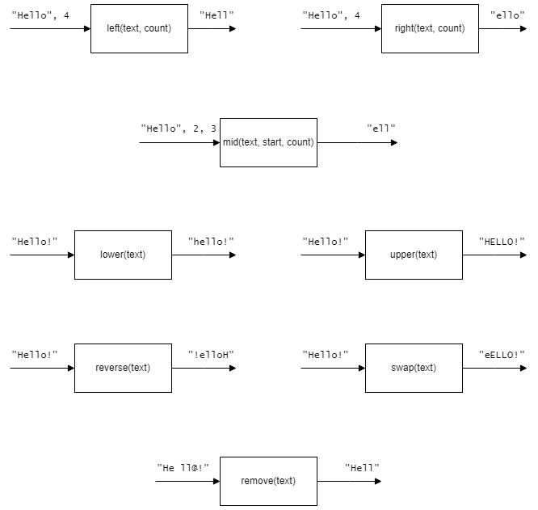

# H SDD - Strings

## Task

Implement the functions shown below.  All the functions should be robust.  If invalid parameters are passed to a function the original text will be returned unchanged.  Save the code as `substring.py`.  

## Testing

Run the file [Substrings-Test.py](assets/Substrings-Test.py "Download file").  The file must be in the same folder as `substring.py`.