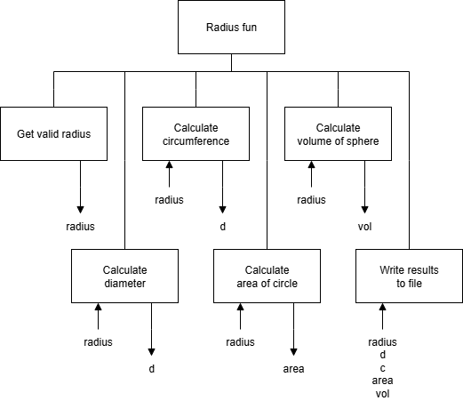

# H SDD - Summer Part 1


## Introduction

Create a file called `summer1.py`.


## Task

Create a modular program to calculate lots of values that are related to the radius of a circle.

The results will be written to the file `radiusFun.txt`.

`pi = 3.1415`

All values are to be rounded to 2 decimal places.


## Program top-level design (Structure Diagram)




### Example: User Interface

```
Radius Fun
----------

Enter the radius: 2.5
```

### Example: radiusFun.txt

```
Radius Fun Results
------------------

Radius: 2.5
Diameter: 5.0
Circumference: 15.71
Area of circle: 19.63
Volume of sphere: 65.45

==================
```
