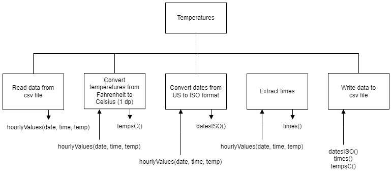

# H SDD - Temperature Dates Part 2

## Introduction

Barra Data Solutions (BDS) is hoping to break into the market for providing data services to other companies.

If a company has a problem with data, BDS intends to be the solution!

The local heritage centre has some histrorical temperature records that it wishes to use.  There is a year's worth of temperature readings, hour by hour, in the file [tempF.csv](assets/tempF.csv "CSV file").  There are 8,759 readings in total.

Unfortunately, the dates are in the US format, and all of the temperatures are in Fahrenheit.


## Task

Convert all of the dates from US to ISO format.  Convert all of the temperatures from Fahrenheit to Celsius.  Write the data to a new csv file.


### Date Format

Example date: 1st August 2022

* US: 08/01/2022 (mm/dd/yyyy)
* ISO: 2022-08-01 (yyyy-mm-dd)


### Temperature Conversion

C = (F - 32) * 5/9


## Steps

1. Read the data into an array of records from a csv file: `tempF.csv`
2. Convert the temperatures from Fahrenheit to Centigrade
3. Convert the dates from US to ISO format
4. Extract the times
5. Write the parallel arrays to a csv file: `tempC.csv`


## Structure diagram




## Example Data

### tempF.csv

```
...
01/31/1910,22:00:00,33.9
01/31/1910,23:00:00,33.4
02/01/1910,00:00:00,33
02/01/1910,01:00:00,32.4
...
```


### tempC.csv

```
...
1910-01-31,22:00:00,1.1
1910-01-31,23:00:00,0.8
1910-02-01,00:00:00,0.6
1910-02-01,01:00:00,0.2
...
```
