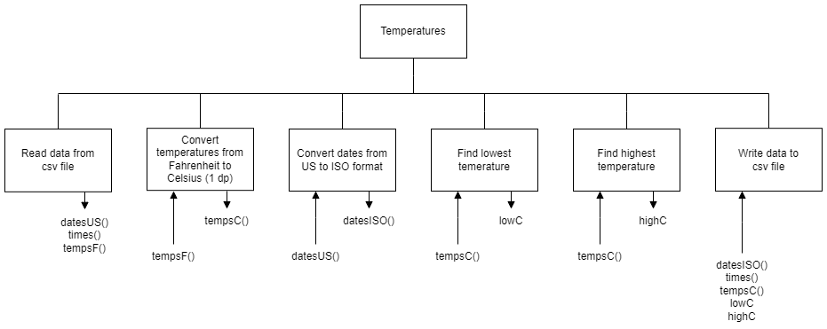

# H SDD - Temperature Dates Part 3

## Introduction

Barra Data Solutions (BDS) is hoping to break into the market for providing data services to other companies.

If a company has a problem with data, BDS intends to be the solution!

The local heritage centre has some histrorical temperature records that it wishes to use.  There is a year's worth of temperature readings, hour by hour, in the file [tempF.csv](assets/tempF.csv "CSV file").  There are 8,759 readings in total.

The heritage centre wants to know what the highest and lowest temperatures were, in Centigrade, and the dates and times they occurred.

Unfortunately, the dates are in the US format, and all of the temperatures are in Fahrenheit.


## Task

Convert all of the dates from US to ISO format.  Convert all of the temperatures from Fahrenheit to Celsius.  Find the extreme temperatures.  Write the extreme temprature dates and times to new text file.


### Date Format

Example date: 1st August 2022

* US: 08/01/2022 (mm/dd/yyyy)
* ISO: 2022-08-01 (yyyy-mm-dd)


### Temperature Conversion

C = (F - 32) * 5/9


## Steps

1. Read the data from a csv file: `tempF.csv`
2. Convert the temperatures from Fahrenheit to Centigrade
3. Convert the dates from US to ISO format
4. Find the lowest temperature.
5. Find the highest temperature.
6. Write the required data to a text file: `extremeC.txt`


## Structure diagram




## Example Data

### tempF.csv

```
...
01/31/1910,22:00:00,33.9
01/31/1910,23:00:00,33.4
02/01/1910,00:00:00,33
02/01/1910,01:00:00,32.4
...
```


### extremeC.txt

```
The minimum temperature was 3.5 deg C on the following dates:

    1910-01-06 at 01:00
    1910-04-09 at 23:00
    1910-05-01 at 02:00

The maximum temperature was 35.7 deg C on the following dates:

    1910-06-30 at 13:00
    1910-07-03 at 16:00
    1910-07-11 at 14:00
```
