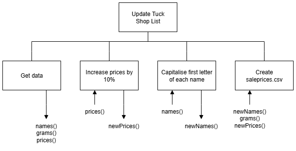

# H SDD - Tuck Shop Part 2

## Introduction

The Youth Cafe runs a tuck shop that sells sweets, crisps, drinks etc. The details of how much each item costs to buy from the Co-op are kept in the file [tuckshop.csv](assets/tuckshop.csv "CSV file").  There are three fields in the file: Name, Weight, and Price.

The Youth Cafe sells the items at a small profit (10%).  A price list is created that shows the details of the items and the price they are sold for.  These details are saved in a file called `pricelist.txt`.

## Task

Write a modular program that will increase the prices by 10%, update the names of the items so each starts with a capital letter, and then save the data in a new file called `pricelist.txt`.  The information is to be written so the file can be printed and used in the tuck shop.

## Program top-level design (Structure Diagram)




### Example: tuckshop.csv

```
...
Haribo Giant Stawbs,16  ,0.30
nutella & Go!,48,1.30
Walkers Ready Salted Crisps,45,1.00
...
```


### Example: pricelist.txt

```
Tuck Shop Price List
--------------------

Freddo (18g) - 28p
Bassetts Wine Gums (165g) - £1.65

...


End of price list!
```
