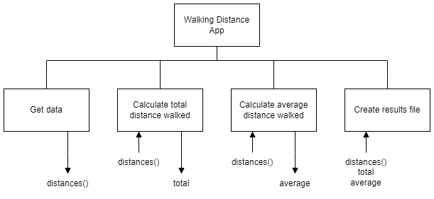

# H SDD - Walking Part 2


## Task

Create a modular program to record how far someone has walked over a four week period.  The program will calculate the total distance, and the average distance walked to 1 decimal point.

The data and the results will be written to the file `walking.txt`.


## Program top-level design (Structure Diagram)




### Example: User Interface

```
Enter the distance walked each week:

Week 1: 12.3
Week 2: 9.7
Week 3: 11.1
Week 4: 12.7
```

### Example: walking.txt

```
Walking Results - 4 Weeks
-------------------------

Week 1: 12.3
Week 2: 9.7
Week 3: 11.1
Week 4: 12.7

Total: 45.8 miles

Average: 11.4 miles (1 dp)
```
