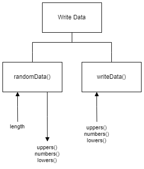

# H SDD - Write Data Part 1

## Introduction

Often, random data is required to help test software.  For a particular task the following data series are required:

1. random uppercase characters (A-Z)
2. random single digits (0-9)
3. random lowercase characters (a-z)

The number of values produced can vary each time the code runs, but the number is the same for all three series.

## Task

Implement a modular program that matches the data flow in the structure digram below.  Save the file as `writeData1.py`.  The data is to be written to a file called `randomData.csv`.

### Top level design (Structure diagram)

## Testing

Run the file [writeData1-Test.py](assets/writeData1-Test.py "Download file").  The file must be in the same folder as `writeData1.py`.
