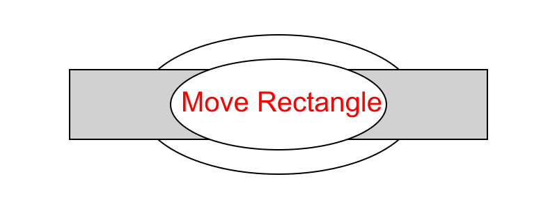

# H CS - Graphics

___Do not change the webpage, only the images!___

## Task

Modify the two images, `svg` and `png`, so that the rectangle appears to be between the two ellipses.

The images can be downloaded and then edited, or edited in [Photopea](https://www.photopea.com/), before being uploaded again.

## Example

Do not change the text.

