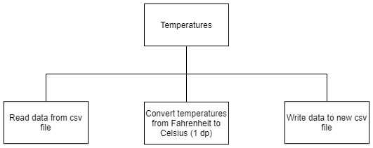

# H SDD - Temperature v1

## Introduction

There are a year's worth of temperature readings in a csv file: 8,759 readings.  All of the readings are in Fahrenheit and need to be converted to Celsius, rounded to 1 decimal place.

## Steps

1. Read the data from a csv file: `tempF.csv`
2. Convert the temperatures
3. Write the data to a csv file: `tempC.csv`

## Structure diagram



## Data

The supplied data is in the format:

* Date: YYYY-MM-DD
* Time: HH:MM:SS
* Temperature: 1 decimal place

```
2010-01-01,01:00:00,34.5
2010-01-01,02:00:00,34.2
2010-01-01,03:00:00,33.9
...
```
