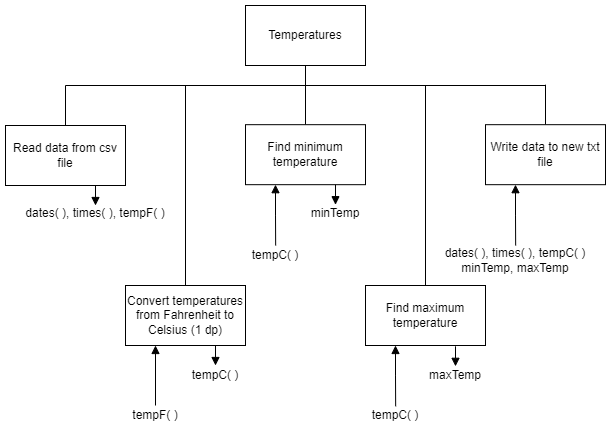
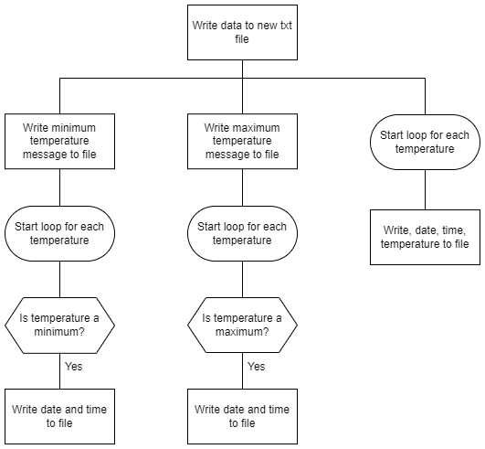

# Instructions

## Overview

There are a year's worth of temperature readings in a csv file: 8,759 readings.  Unfortunately, they are all in Fahrenheit and need to be converted to Celsius, rounded to 1 decimal place.

Additionally, dates of all the minimum and maximum temperatures are to be found.

The output is to be written to a text file.  An example of the output is:

```
The minimum temperature was 3.5 deg C on the following dates:  
2010-01-06,01:00:00
2010-04-09,23:00:00
2010-05-01,02:00:00

The maximum temperature was 35.7 deg C on the following dates:  
2010-06-30,13:00:00
2010-07-03,16:00:00
2010-07-11,14:00:00

Data:  
2010-01-01,01:00:00,1.4 
2010-01-01,02:00:00,1.2
...
```

## Steps

1. Read the data from a csv file: `tempF.csv`
2. Convert the temperatures
3. Find the minimum temperature
4. Find the maximum temperature
5. Write the data to a csv file: `results.txt`

## Structure diagram

### Data flow



### Refinement



## Data

The supplied data is in the format:

* Date: YYYY-MM-DD
* Time: HH:MM:SS
* Temperature: 1 decimal place

```
2010-01-01,01:00:00,34.5
2010-01-01,02:00:00,34.2
2010-01-01,03:00:00,33.9
...
```
