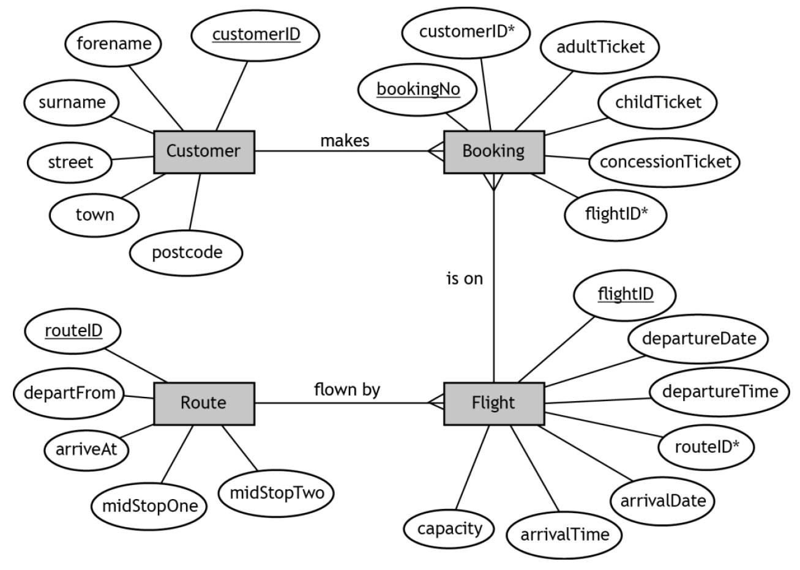
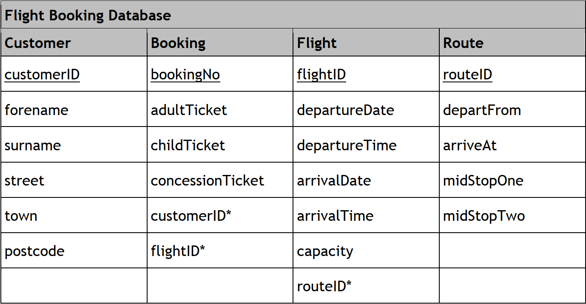

# H CS 2019 Task 1 Part C - Extension

### Database design and development

#### Entity-relationship diagram 

## Extension Questions

* For each of the following questions write and test the SQL required to create the described output.

* The questions involve calculations, wildcards and aggregate functions (AVG, SUM, MIN, MAX, and COUNT).

* Make sure you create aliases where appropriate.

### Questions

___1d(i)___ Display the total number of adult tickets, purchased by passengers living in postcode area EH. (__4 marks__) 

___1d(ii)___ Display the total number of passengers whose flights departed in April 2018. (__5 marks__)

___1d(iii)___ Display the average capacity of all the flights that departed from any airport with a code ending with “N”.  (__4 marks__)

___1d(iv)___ Display the number of customer bookings by town.

This should be limited to flights that arrived at London Heathrow (LHR) in 2018.  (__6 marks__)

___1d(v)___ Customer Grant Reid has purchased an extra travel bag for every adult and child costing £15 each.

Display the total amount this customer has spent on bags.  (__5 marks__)

___1d(vi)___ Flight A131T531Y47 charged the following for ticket fares: adult £55, child £40, concession £30. 

Calculate and display each customer’s name and the total fares paid by each customer on this flight.  (__6 marks__)

___1d(vii)___ Airport tax is charged at £7.50 for an adult and £5.00 for a child.

Display the forename and surname of passengers along with the difference between the total airport tax of the adult tickets purchased and the total airport tax of the child tickets purchased.

The output should be limited to flights that had one stop at AMS (Amsterdam) between the departure airport and the arrival airport.  (__6 marks__)
