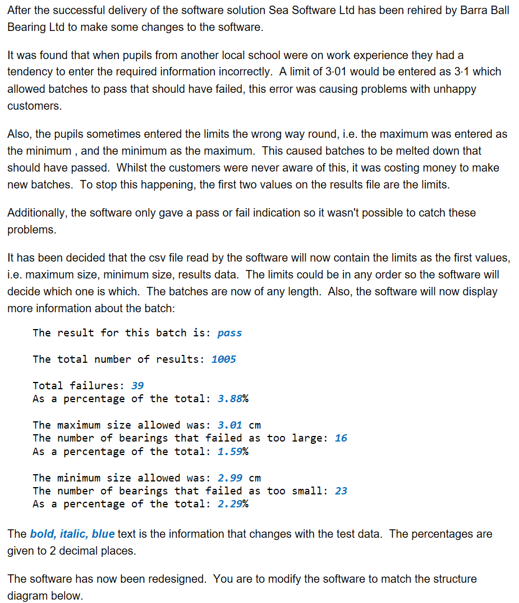

# H SDD - Ball Bearings v2

After the successful delivery of the software solution Sea Software Ltd has been rehired by Barra Ball Bearing Ltd to make some changes to the software.

It was found that when pupils from another local school were on work experience they had a tendency to enter the required information incorrectly.
A limit of 3·01 would be entered as 3·1 which allowed batches to pass that should have failed, this error was causing problems with unhappy customers.

Also, the pupils sometimes entered the limits the wrong way round, i.e. the maximum was entered as the minimum , and the minimum as the maximum.
This caused batches to be melted down that should have passed.  Whilst the customers were never aware of this, it was costing money to make new batches.
To stop this happening, the first two values on the results file are the limits.

Additionally, the software only gave a pass or fail indication so it wasn't possible to catch these problems.

It has been decided that the csv file read by the software will now contain the limits as the first values, i.e. maximum size, minimum size, results data.
The limits could be in any order so the software will decide which one is which.
The batches are now of any length.  Also, the software will now display more information about the batch:

```
The result for this batch is: pass

The total number of results: 1005

Fail: 39
Pass: 966
Percentage fail: 3.88%

Maximum size: 3.01 cm
Failed - too large: 16
Percentage of total: 1.59%

Minimum size: 2.99 cm
Failed - too small: 23
Percentage of total: 2.29%
```

The percentages are given to 2 decimal places.

The software has now been redesigned.
You are to modify the software to match the structure diagram below.

