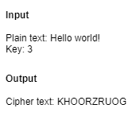
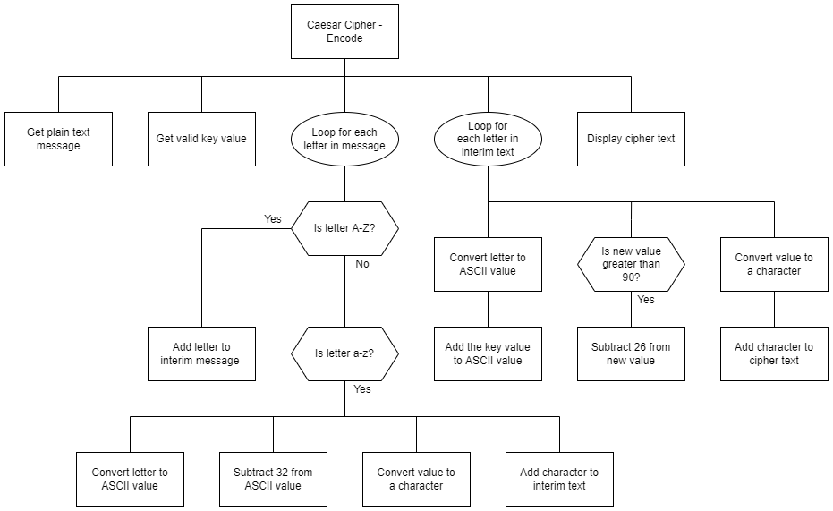

# Caesar Cipher  

## Introduction

A Caesar cipher is a simple shift cipher.  Each letter of a plain text message is shifted by a set number of places.

With a shift of 3, __A__ becomes __D__, and __M__ becomes __P__.

Whilst Julius Caesar used the cipher to encrypt messages over 2,000 years ago, today it can be quickly decrypted without knowing the shift key.

## Useful website

The [cryptii website](https://cryptii.com/pipes/caesar-cipher) can quickly encrypt and decrypt messages.

Use it to check your cipher text.

__NB__  By default the cryptii cipher text will include upper and lower case letters, spaces, and punctuation.

## Task

Use the structure diagram to create a program that allows the user to enter a plain text message and key.

The message will be stripped of any characters that are letters, and all letters changed to uppercase.

The message will then be encrypted and displayed.

## User Experience

## Structure diagram

  
