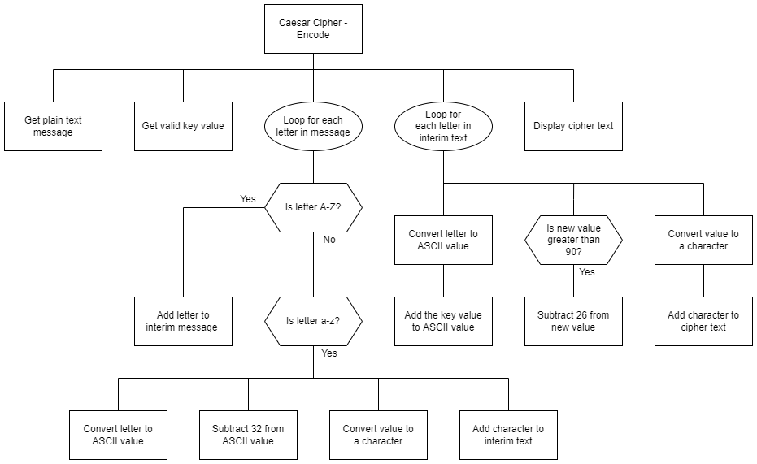

# H SDD - Caesar Cipher  

## Introduction

A Caesar cipher is a simple shift cipher.  Each letter of a plain text message is shifted by a set number of places.

With a shift of 3, __a__ becomes __d__, and __m__ becomes __p__.

Julius Caesar used the cipher to encrypt messages over 2,000 years ago but today it can be quickly decrypted without knowing the shift key.

## Task

Use the structure diagram to create a sub-program that encrypt a plain message and return the cipher text.

All punctuation and spaces are ignored.  The cipher text will all be lowercase.


## Examples

### Example 1

``` python
print(encode("Hello!", 1))
```

```
ifmmn
```

### Example 2

``` python
print(encode("abc XYZ", 3))
```

```
defabc
```

### Example 3

``` python
print(encode("abc XYZ", 3))
```

```
defabc
```

## Structure diagram

  
