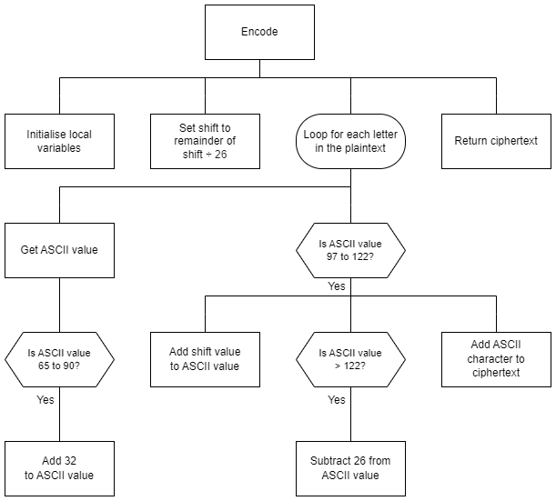

# H SDD - Caesar Cipher  


## Introduction

A Caesar cipher is a simple shift cipher.  Each letter of a plain text message is shifted by a set number of places.

With a shift of 3, __a__ becomes __d__, and __m__ becomes __p__.  The end of the alhpabet wraps around to the beginning.

Julius Caesar used the cipher to encrypt messages over 2,000 years ago but today it can be quickly decrypted without knowing the shift key.


## Task

Use the structure diagram to create a sub-program that will encrypt a plain text message and return the cipher text.

All punctuation and spaces are ignored.  The cipher text will all be lowercase.


## Structure diagram

  


## Examples

### Example 1

#### Code
``` python
print(encode("Hello!", 1))
```

#### Output
```
ifmmn
```

### Example 2

#### Code
``` python
print(encode("abc XYZ", 3))
```

#### Output
```
defabc
```

