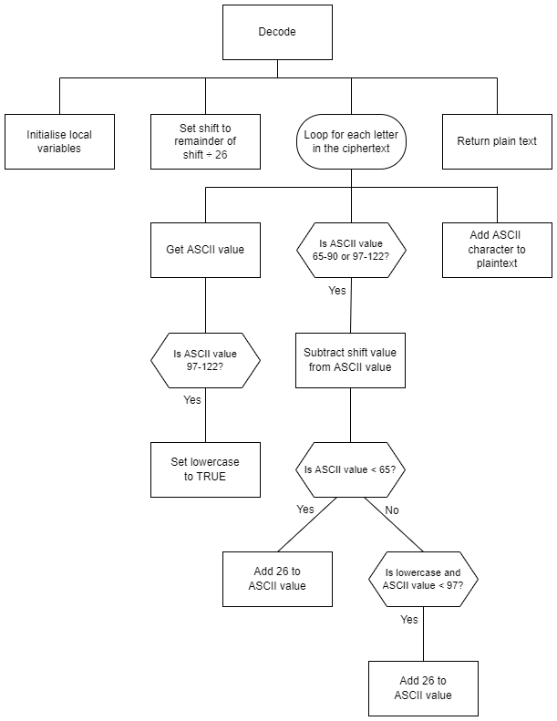

# H SDD - Caesar Cipher Part 2


## Task

Use the structure diagram to create a sub-program that will decrypt a ciphertext message and return the plaintext.

All punctuation and spaces are maintained.  The plaintext will have the same case as the ciphertext.

Save the code as `caesar.py`.


## Structure diagram




## Examples

### Example 1

#### Code
``` python
print(decode("Ifmmn!", 1))
```

#### Output
```
Hello!
```

### Example 2

#### Code
``` python
print(encode("def ABC", 29))
```

#### Output
```
abc XYZ
```

## Testing

Run the file [Caesar-Test.py](assets/Caesar-Test.py "Download file") and choose 'Decode test'.  The file must be in the same folder as `caesar.py`.
