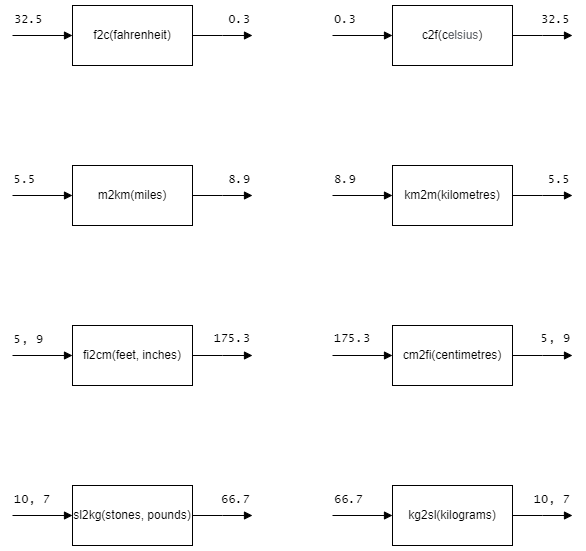

# H SDD - Convert

## Task

Create multiple sub-programs that do the conversions shown.  The expected number of decimal places are shown for each function.  Ensure the functions use the names shown, and save the code as `convert.py`.

## Testing

Run the file [Convert-Test.py](assets/Convert-Test.py "Download file").  The file must be in the same folder as `convert.py`.
