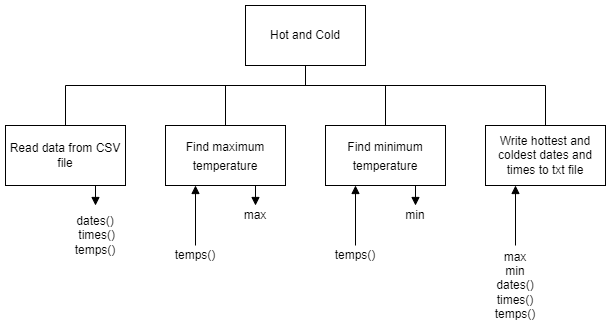

# Instructions

## Introduction

Barra Data Solutions (BDS) has been contracted to find the minimum and maximum temperatures within a data set.

## Task

Follow the design shown in the structure diagram to produce modular code.  The output must be similiar to the example output but with the correct temperatures, dates, and times.

## Steps

1. Read the data from `Temperature Data.csv`
2. Find the maximum temperature
3. Find the minimum temperature
4. Write all occurences of the hottest and coldest temperatures to `Hot and Cold.txt`

## Structure diagram

## Example Output

The maximum temperature was 52 degrees Fahrenheit.  This temperature occurred at the following dates and times:

2010-01-06,01:00:00  
2010-01-09,12:00:00

The minimum temperature was 32 degrees Fahrenheit.  This temperature occurred at the following dates and times:

2010-01-06,01:00:00  
2010-01-09,12:00:00