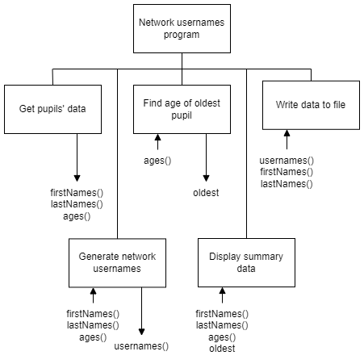

# H SDD - Network Usernames

## Program analysis

A program is needed to produce usernames for pupils so they can use any of the school's computers. The usernames consist of the first six letters of a pupil's forename.  If their forename is too short, additional letters from their surname will be added.  The following will be added at the end of the letters:

* A single digit
* A single letter

The digit is the remainder of their age when divided by 9, plus 1.

```
  13 ÷ 9 = 1 remainder 4
  4 + 1 = 5
```

The letter uses the first letter of their surname, and is the lowercase version of the next letter in the alphabet.

```
  A => b
  Z => a
```
All letters in the username are lowercase.

Example usernames:

```
Sam Waite aged 9 => samwai1x
Elizabeth Perkins aged 13 => elizab5q
```

As a check, the oldest age of the 25 pupils is found and used to display the oldest pupils.

The pupils' usernames and names need to be written to a separate CSV file so they can be used with other software.

## Assumptions

The data in the CSV file is correctly formatted with the data of 25 pupils.

Example data:

```
Alan,Turing,14
Dorothy,Vaughan,12
Larry,Page,11
Grace,Hopper,7
Tim,Berners-Lee,9
...
```

## Program design



### Refinements

```
4.1 Display "The oldest pupils are aged " + oldest
4.2 Display "They are: "
4.3 Loop for twenty five pupils
4.4   If current pupil's age is same as oldest then
4.5     Display pupil's name
4.6   End if
4.7 End loop
```

## Task 

Produce a program that follows the design.

Four batches of data are provided.  Use `batch1.csv` only.

Create additional helper functions as required.