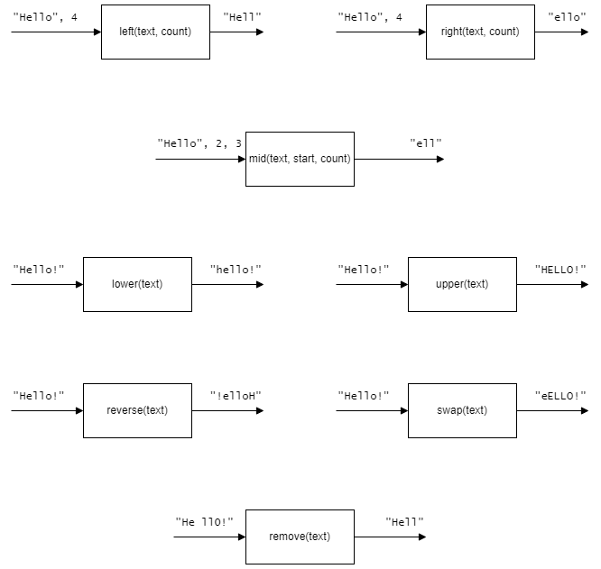

# H SDD - Substrings

## Task

Create multiple sub-programs that will create the substrings shown.  Save the code as `substrings.py`.  The functions should be robust.

## Testing

Run the file [Substrings-Test.py](assets/Substrings-Test.py "Download file").  The file must be in the same folder as `convert.py`.
