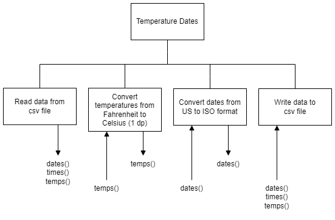

# H SDD - Temperature Dates v1

## Introduction

Barra Data Solutions (BDS) is hoping to break into the market for providing data services to other companies.

If a company has a problem with data, BDS intends to be the solution!

The local heritage centre has some histrorical temperature records that it wishes to use.  There is a year's worth of temperature readings, hour by hour, in a csv file: 8,759 readings.

Unfortunately, the dates are in the US format, and all of the temperatures are in Fahrenheit.

## Task

Convert all of the dates from US to ISO format.  Convert all of the temperatures from Fahrenheit to Celsius.  Write the data to a new csv file.

### Date Format

Example date: 1st August 2022

* US: mm-dd-yyyy __/__ 08-01-2022
* ISO: yyyy-mm-dd __/__ 2022-08-01

### Temperature Conversion

C = (F - 32) * 5/9

## Steps

1. Read the data from a csv file: `tempF.csv`
2. Convert the temperatures from Fahrenheit to Centigrade
3. Convert the dates from US to ISO format
5. Write the data to a csv file: `tempC.csv`

## Structure diagram



### Refinements

```
2.1 Loop for each temperature
    2.1.1 Call function to convert current temperature
        IN: tempF
        OUT: tempC

3.1 Loop for each date
    3.1.1 Call function to convert current date
        IN: dateUS
        OUT: dateISO
```
